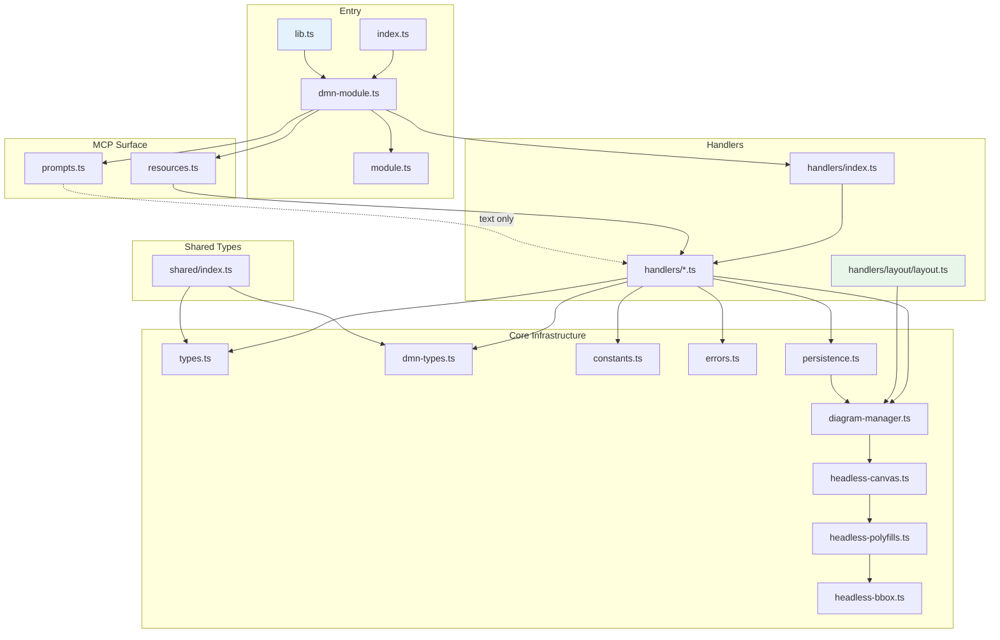

# Architecture

## Overview

DMN-MCP is a Model Context Protocol (MCP) server that lets AI assistants create and manipulate DMN (Decision Model and Notation) diagrams. It uses `dmn-js` running headlessly via `jsdom` to produce valid DMN XML and SVG output. Supports DRD editing, decision tables, literal expressions, and FEEL parsing.

## Module Dependency Diagram



## Module Boundaries

| Module                 | May import from                                     | Must NOT import from |
| ---------------------- | --------------------------------------------------- | -------------------- |
| `src/handlers/layout/` | `types.ts`, `dmn-types.ts`, `constants.ts`, `elkjs` | _(no restrictions)_  |
| `src/handlers/`        | Everything above                                    | _(no restrictions)_  |
| `src/prompts.ts`       | `@modelcontextprotocol/sdk`                         | `handlers/`          |
| `src/resources.ts`     | `diagram-manager`, `handlers/`                      | _(no restrictions)_  |

These rules keep `elk/` as an independent leaf module that can be extracted into a separate package if needed.

## Dependency Flow

```
Allowed dependency direction: top → bottom

  index.ts / dmn-module.ts / lib.ts
           │
    handlers/index.ts ◄── resources.ts
           │
    handlers/*.ts
      │    │
      │    └──► handlers/layout/layout.ts (elkjs)
      │
      └──► diagram-manager.ts ──► headless-canvas.ts
```

## Directory Layout

| Directory / File            | Responsibility                                                  |
| --------------------------- | --------------------------------------------------------------- |
| `src/index.ts`              | Entry point — wires MCP server, transport, and tool modules     |
| `src/module.ts`             | Generic `ToolModule` interface for pluggable editor back-ends   |
| `src/dmn-module.ts`         | DMN tool module — registers tools and dispatches calls          |
| `src/types.ts`              | Shared interfaces (`DiagramState`, `ToolResult`, `DmnModeler`)  |
| `src/dmn-types.ts`          | TypeScript interfaces for dmn-js DRD services                   |
| `src/constants.ts`          | Centralised magic numbers (`STANDARD_DMN_GAP`, `ELEMENT_SIZES`) |
| `src/errors.ts`             | Machine-readable error codes and McpError factory functions     |
| `src/headless-canvas.ts`    | jsdom setup, lazy `DmnModeler` init                             |
| `src/headless-polyfills.ts` | SVG/CSS polyfills for headless dmn-js                           |
| `src/headless-bbox.ts`      | Element-type-aware bounding box estimation                      |
| `src/diagram-manager.ts`    | In-memory `Map<string, DiagramState>` store                     |
| `src/persistence.ts`        | Optional file-backed diagram persistence                        |
| `src/lib.ts`                | Library entry point for integration with other MCP servers      |
| `src/prompts.ts`            | MCP Prompts — reusable step-by-step modeling workflows          |
| `src/resources.ts`          | MCP Resources — `dmn://` URI endpoints for diagram data         |
| `src/tool-definitions.ts`   | Thin re-export of TOOL_DEFINITIONS                              |
| `src/shared/index.ts`       | Cross-cutting type re-export barrel                             |
| `src/handlers/`             | One handler file per MCP tool                                   |
| `src/handlers/index.ts`     | Tool registry + dispatch map + re-exports                       |
| `src/handlers/layout/`      | ELK-based auto-layout engine for DRD (via elkjs)                |

## Where to Put New Code

```
Need to add…                         → Put it in…
─────────────────────────────────────────────────────────────────
A new MCP tool                       → src/handlers/<category>/<name>.ts
                                       (export handler + TOOL_DEFINITION,
                                        add to TOOL_REGISTRY in index.ts)

A new dmn-js type/interface          → src/dmn-types.ts

A new shared constant                → src/constants.ts

A polyfill for headless dmn-js       → src/headless-polyfills.ts
                                       or src/headless-bbox.ts

Cross-cutting types needed by tests  → src/shared/index.ts (re-export barrel)

A layout algorithm improvement       → src/handlers/layout/layout.ts

A new MCP prompt                     → src/prompts.ts

A new MCP resource                   → src/resources.ts
```

## Core Patterns

1. **Headless dmn-js via jsdom** — A shared `jsdom` instance polyfills browser APIs so `dmn-js` can run in Node.js without a browser.

2. **In-memory diagram store** — Diagrams live in a `Map<string, DiagramState>` keyed by generated IDs. Optional file-backed persistence can be enabled.

3. **Co-located tool definitions** — Each handler file exports both the handler function and its `TOOL_DEFINITION` schema, preventing definition drift (see [ADR-001](../agents/adrs/ADR-001-co-located-tool-definitions.md)).

4. **Unified tool registry** — The `TOOL_REGISTRY` array in `src/handlers/index.ts` is the single source of truth. Both `TOOL_DEFINITIONS` and the dispatch map are auto-derived from it.

5. **Camunda moddle extension** — `camunda-dmn-moddle` is registered on every modeler instance, enabling Camunda-specific attributes.

6. **Multi-view DMN** — dmn-js supports DRD, decision table, literal expression, and boxed expression views. The modeler can switch between them via `modeler.open(view)`.
